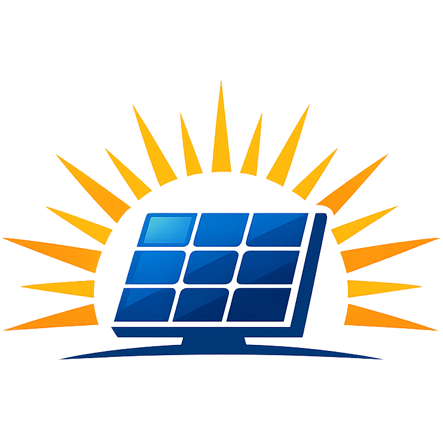
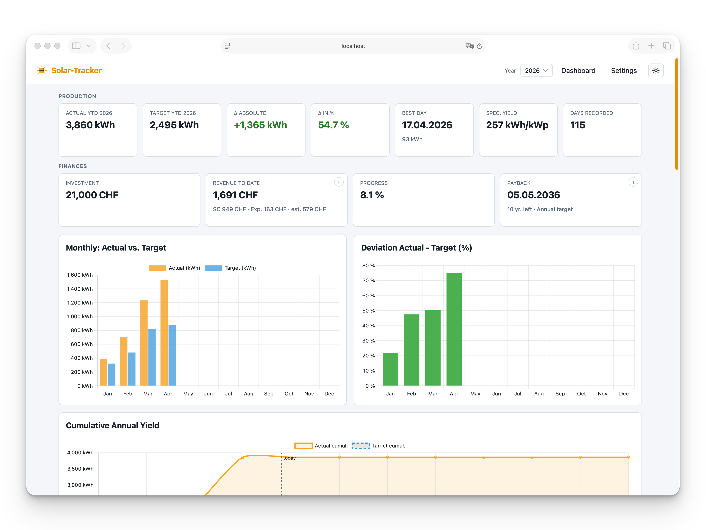
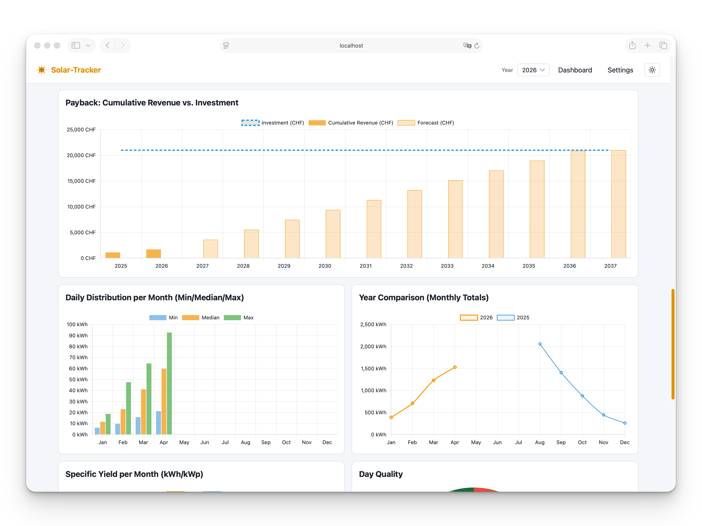
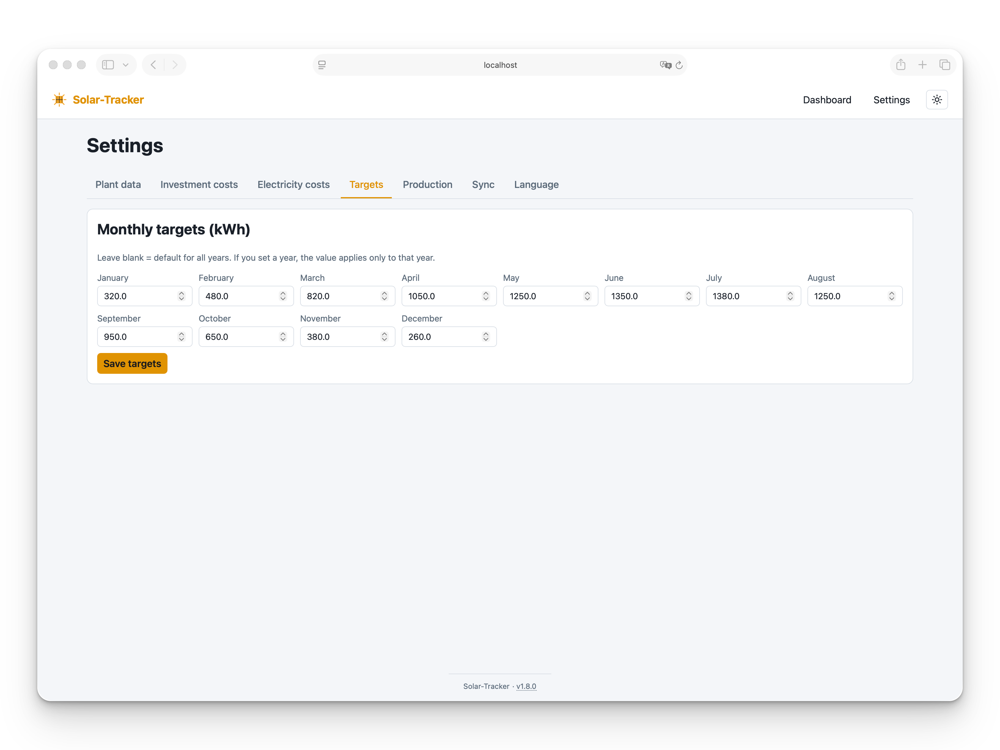
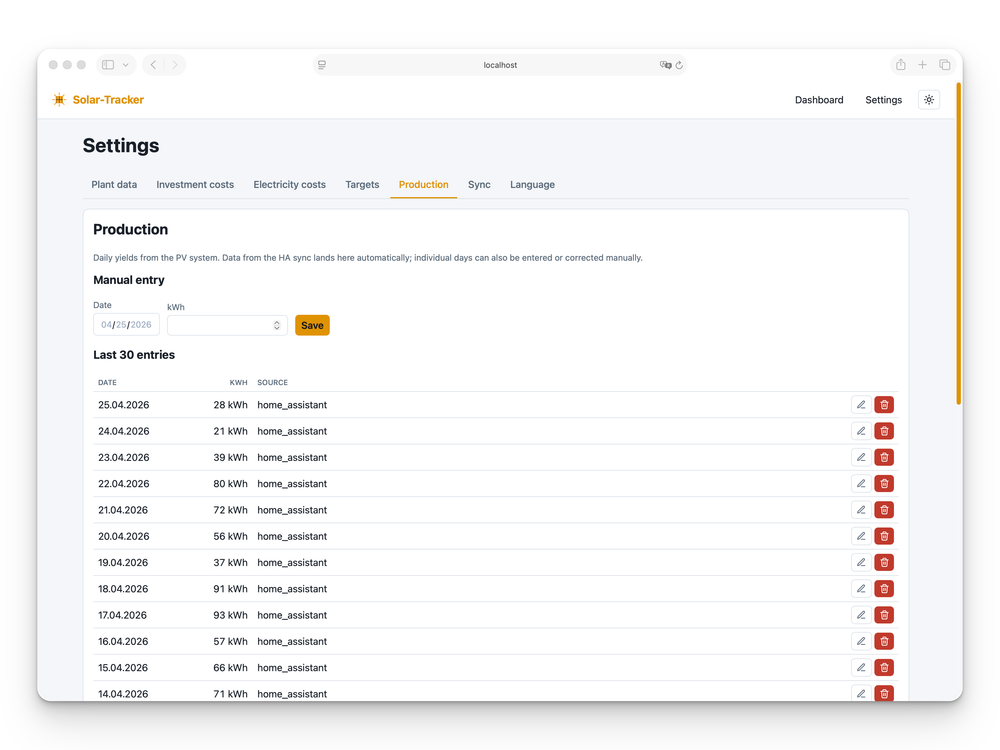
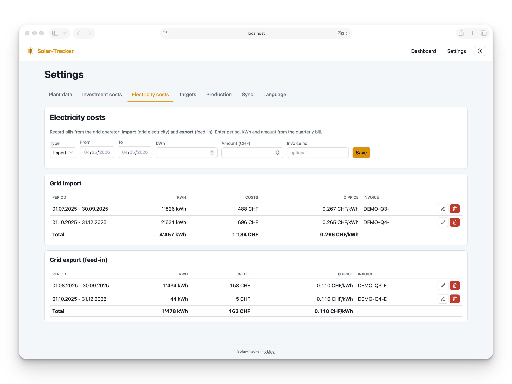
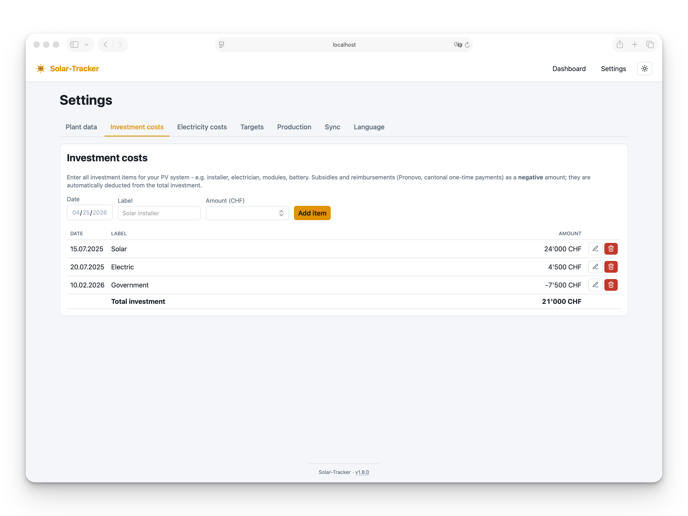

# Solar-Tracker

<p align="center">
  
</p>

<p align="center">
  <a href="https://github.com/xenofex7/solar-tracker/releases"></a>
  <a href="https://github.com/xenofex7/solar-tracker/blob/main/LICENSE"></a>
  
  <a href="https://github.com/xenofex7/solar-tracker/pkgs/container/solar-tracker"></a>
  <a href="https://github.com/xenofex7/solar-tracker/actions/workflows/docker.yml"></a>
  <a href="https://github.com/xenofex7/solar-tracker/actions/workflows/ci.yml"></a>
  
  
</p>

<p align="center">
  <a href="https://xenofex7.github.io/solar-tracker/"><strong>xenofex7.github.io/solar-tracker</strong></a>
</p>

A small, locally-hosted web app that compares **actual** vs. **target** solar
yield. Actuals come from **Home Assistant** (Long-Term Statistics via
WebSocket) or **manual entry**. Targets are monthly kWh goals from the plant
planning.

## Screenshots

<p align="center">
  
</p>
<p align="center">
  
</p>
<p align="center">
  
  
</p>
<p align="center">
  
  
</p>

## Quick start

```bash
python -m venv .venv
source .venv/bin/activate
pip install -r requirements.txt
cp .env.example .env      # set HA_URL, HA_TOKEN, HA_ENTITY_ID
python seed_demo.py       # optional: demo data so the charts render
python app.py             # opens http://localhost:5000
```

## Security

Solar-Tracker has **no built-in authentication or authorisation**. Anyone who
can reach the HTTP port can read all data and change settings (targets,
electricity prices, investment costs) and trigger Home Assistant syncs.

Only run it on `localhost` or inside a trusted private network. Do **not**
expose the port directly to the internet. If remote access is needed, put it
behind a reverse proxy that enforces authentication (e.g. Caddy/nginx with
basic auth, Authelia, Tailscale, or a VPN).

## Docker

The published image is hosted on GitHub Container Registry and
`docker-compose.yml` references it by default, so no source checkout
is required to deploy:

```bash
mkdir solar-tracker && cd solar-tracker
curl -O https://raw.githubusercontent.com/xenofex7/solar-tracker/main/docker-compose.yml
curl -O https://raw.githubusercontent.com/xenofex7/solar-tracker/main/.env.example
mv .env.example .env      # set HA_URL, HA_TOKEN, HA_ENTITY_ID
docker compose up -d      # pulls ghcr.io/xenofex7/solar-tracker:latest
```

The SQLite database lives in `./data` on the host (mounted into the
container), so stopping or recreating the container preserves all
data. The container runs gunicorn with two workers.

Available tags: `latest`, plus pinned major / minor / patch tags
(e.g. `1`, `1.8`, `1.8.0`). See
[ghcr.io/xenofex7/solar-tracker](https://github.com/xenofex7/solar-tracker/pkgs/container/solar-tracker).

If you have the source checked out, `docker compose build` rebuilds
the image locally (the compose file keeps `build: .` as a fallback).

## Features

### Dashboard

- 14 charts including monthly actual vs. target, deviation in %,
  cumulative yearly yield, daily production with 7-day rolling average,
  calendar heatmap, daily distribution per month (min/median/max),
  year-on-year comparison, top 5 days, specific yield (kWh/kWp) and
  day quality donut.
- Payback chart with cumulative revenue vs. investment and forecast.
- Energy and finance flow charts per billing period (import, export,
  self-consumption, savings vs. no PV).
- KPI tiles in three groups:
  - **Production:** YTD actual / target, Δ absolute / %, best day,
    specific yield, days recorded.
  - **Finances:** investment, revenue to date, progress, payback date.
  - **Self-consumption & grid:** net cost, savings vs. no PV, effective
    electricity price, self-consumed, self-consumption rate.

### Data sources

- Home Assistant (Long-Term Statistics via WebSocket).
- Manual daily entry on `/entry`.
- Quarterly grid bills (import + export) on `/settings`.

### Other

- 5 languages (DE, EN, FR, IT, ES), light + dark mode.
- Dates as `dd.mm.yyyy`, Swiss thousands (`1'234 kWh`).
- "Today" marker on daily and cumulative charts (current year only).
- YTD target is pro-rated to today for the current year.

## Home Assistant

The app connects to `HA_URL` via WebSocket and calls
`recorder/statistics_during_period` with `period: "day"` and
`types: ["change"]`. Data therefore comes from **Long-Term Statistics**, which
Home Assistant keeps indefinitely - unlike the recorder history, which is
purged after `purge_keep_days`. This lets you back-fill and re-sync multiple
years at once.

Expected sensor: an energy sensor with `device_class: energy` and
`state_class: total_increasing` (or `total`), e.g. `sensor.solar_total_energy`.

The sync form on `/settings` defaults to the last six months. Each run
overwrites existing entries for the selected days - including manual ones -
so the database stays in sync with Home Assistant.

## Configuration

`.env` keys:

| Key             | Purpose                                                    |
| --------------- | ---------------------------------------------------------- |
| `HA_URL`        | Base URL of Home Assistant (e.g. `http://ha.local:8123`)   |
| `HA_TOKEN`      | Long-Lived Access Token                                    |
| `HA_ENTITY_ID`  | Statistic entity (e.g. `sensor.solar_total_energy`)        |
| `PLANT_KWP`     | Installed peak power, used for specific yield (kWh/kWp)    |
| `FLASK_HOST`    | Bind address (default `127.0.0.1`, set `0.0.0.0` in Docker) |
| `FLASK_PORT`    | HTTP port (default `5000`)                                 |
| `FLASK_DEBUG`   | `true` enables Flask debug mode                            |

The plant size can also be set on `/settings`, which overrides `PLANT_KWP`.

## Help

Bug reports and feature requests are welcome on
[GitHub Issues](https://github.com/xenofex7/solar-tracker/issues).
